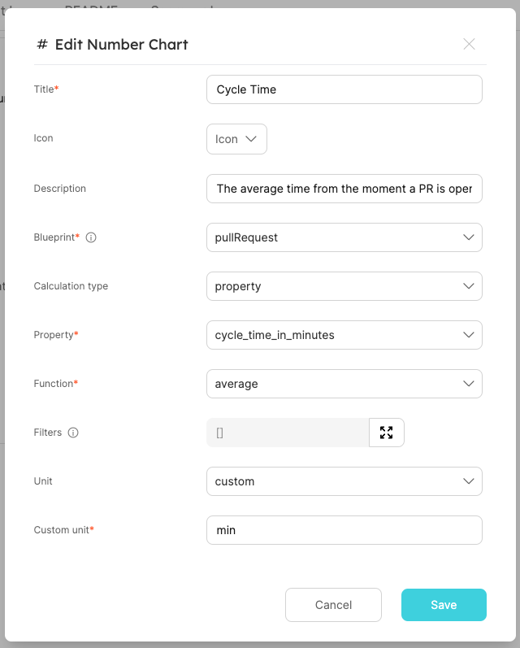
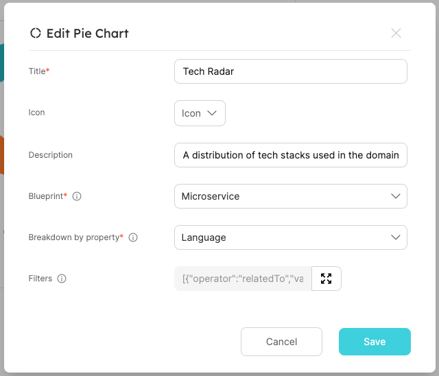

# Building A Fully Operational Internal Developer Platform

This repository contains the different resources used during Port's live webinar from 30.05.2023 - Building a fully operational internal developer platform.

You can view the webinar here.

# Table of contents

- [Building A Fully Operational Internal Developer Platform](#building-a-fully-operational-internal-developer-platform)
- [Table of contents](#table-of-contents)
  - [Initial Setup](#initial-setup)
  - [Blueprints](#blueprints)
    - [Definitions](#definitions)
  - [Entities](#entities)
    - [Definitions](#definitions-1)
  - [Self-service actions](#self-service-actions)
    - [Definitions](#definitions-2)
    - [Trigger payloads](#trigger-payloads)
  - [GitHub workflows](#github-workflows)
  - [K8s exporter config](#k8s-exporter-config)
    - [Deploying the K8s exporter and the config](#deploying-the-k8s-exporter-and-the-config)
      - [Initial deployment](#initial-deployment)
      - [Updated deployment](#updated-deployment)
  - [Scorecards](#scorecards)
  - [Visualizations](#visualizations)
    - [Microservice cycle time chart](#microservice-cycle-time-chart)
    - [Domain tech radar chart](#domain-tech-radar-chart)

## Initial Setup

The webinar does start with an environment that has some initial setup:

- It has 2 K8s clusters (specifically provisioned on EKS but any K8s cluster will do), one will be the `test` cluster and one the `prod` cluster
- It has a GitHub organization that Port's GitHub App will be installed on, in addition to containing some initial repositories that will automatically be ingested as microservice entities, the organization also includes a repository with a scaffolder GitHub workflow that will be used to create a new repository microservice

Here are the different resources provided in this repository:

## Blueprints

Not all blueprints used during the webinar are listed here, only the ones that are not provided by a Port template, or ones that are extended from their original template format, in order to follow along and avoid any errors due to missing blueprints or relations, we recommend to go over the following flow when using the blueprints from this repository:

1. Create the domain blueprint
2. Create the system blueprint
3. Create the environment blueprint
4. Deploy the GitHub template
5. Deploy the K8s template
6. Update the microservice blueprint
7. Update the workload blueprint
8. Update the workflowRun blueprint
9. Continue following along with the rest of the resources

### Definitions

- [`domain`](./blueprints//domain.json) blueprint
- [`system`](./blueprints/system.json) blueprint
- [`environment`](./blueprints/environment.json) blueprint
- [`microservice`](./blueprints/microservice.json) blueprint - note that this blueprint is created by the GitHub template used during the webinar, but over the course of the webinar it is extended, so all of these extensions can be seen in the file provided here.
- [`workload`](./blueprints/workload.json) blueprint - note that this blueprint is created by the K8s template template used during the webinar, but over the course of the webinar it is extended, so all of these extensions can be seen in the file provided here.
- [`workflowRun`](./blueprints/workflowRun.json) blueprint - note that this blueprint is created by the GitHub template used during the webinar, but over the course of the webinar it is extended, so all of these extensions can be seen in the file provided here.

## Entities

Most entities in the webinar are created automatically by the different apps, actions and exporters, but some are created manually to tie everything together, these entity definitions will be provided here

### Definitions

- [`subscription`](./entities/subscription.json) domain entity
- [`authentication`](./entities/authentication.json) system entity
- [`prod`](./entities/prod.json) environment entity
- [`test`](./entities/test.json) environment entity

## Self-service actions

During the webinar we use 3 different self-service actions, they are all provided here along with the payloads used to trigger them.

### Definitions

- [`scaffoldMicroservice.json`](./self-service-actions/scaffoldMicroservice.json) - The definition of the scaffold microservice action
- [`deployToTest.json`](./self-service-actions/deployToTest.json) - The definition of the deploy to test action
- [`deployToProd.json`](./self-service-actions/deployToProd.json) - The definition of the deploy to prod action

### Trigger payloads

- [`auth-service.json`](./self-service-actions/payloads/auth-service.json) - scaffold the auth microservice
- [`notification-service-test.json`](./self-service-actions/payloads/notification-service-test.json) - deploy the notification service to the test cluster
- [`notification-service-prod.json`](./self-service-actions/payloads/notification-service-prod.json) - deploy the notification service to the prod cluster

## GitHub workflows

During the webinar we use 3 different GitHub workflows, they are all provided here along with an explanation of the secrets required to run them.

- [`scaffold-cookiecutter`](./github-workflows/scaffold-cookiecutter.yml) - this is the code for the GitHub workflow that will scaffold a new microservice by creating a new repository based on a Cookiecutter template.
  - The workflow requires the following secrets to run:
    - `PORT_CLIENT_ID` - a client ID used to get an access token from Port
    - `PORT_CLIENT_SECRET` - a client secret used to get an access token from Port
    - `ORG_TOKEN` - A GitHub personal access token with permissions to create a new repository
- [`deploy-to-test`](./github-workflows/deploy-to-test.yml) - this is the code for the GitHub workflow that will deploy the notification service to the test EKS cluster.
  - The workflow requires the following secrets to run:
    - `PORT_CLIENT_ID` - a client ID used to get an access token from Port
    - `PORT_CLIENT_SECRET` - a client secret used to get an access token from Port
    - `AWS_ACCESS_KEY_ID` - An AWS access key ID used to authenticate with AWS (only required if connecting to an EKS cluster)
    - `AWS_SECRET_ACCESS_KEY` - An AWS secret access key used to authenticate with AWS (only required if connecting to an EKS cluster)
    - `KUBE_CONFIG_DATA_TEST` - A base64 encoded kubeconfig with the information to connect to the K8s cluster
  - The workflow will create a new namespace and deployment according to the following [`app.yml`](./config/test/app.yml) file, it makes use a public docker image
- [`deploy-to-prod`](./github-workflows/deploy-to-prod.yml) - this is the code for the GitHub workflow that will deploy the notification service to the prod EKS cluster.
  - The workflow requires the following secrets to run:
    - `PORT_CLIENT_ID` - a client ID used to get an access token from Port
    - `PORT_CLIENT_SECRET` - a client secret used to get an access token from Port
    - `AWS_ACCESS_KEY_ID` - An AWS access key ID used to authenticate with AWS (only required if connecting to an EKS cluster)
    - `AWS_SECRET_ACCESS_KEY` - An AWS secret access key used to authenticate with AWS (only required if connecting to an EKS cluster)
    - `KUBE_CONFIG_DATA_TEST` - A base64 encoded kubeconfig with the information to connect to the K8s cluster
  - The workflow will create a new namespace and deployment according to the following [`app.yml`](./config/prod/app.yml) file, it makes use a public docker image

## K8s exporter config

During the webinar we make an update to the K8s exporter config, adding some more mappings that extend the defaults provided by Port's template.

- [`exporter-config-test.yml`](./config/test/exporter-config-test.yml) - the updated K8s exporter config for the test cluster
- [`exporter-config-prod.yml`](./config/prod/exporter-config-prod.yml) - the updated K8s exporter config for the prod cluster

### Deploying the K8s exporter and the config

In order to deploy Port's K8s exporter you will need to use the following commands:

#### Initial deployment

This snippet will also be provided to you by Port when initially using the K8s template inside Port

**Important:** please setup the K8s template in Port before deploying the K8s exporter!

**Deploy the exporter to the test K8s cluster:**

```bash
export CLUSTER_NAME="test"
export PORT_CLIENT_ID="PORT_CLIENT_ID"
export PORT_CLIENT_SECRET="PORT_CLIENT_SECRET"
curl -s https://raw.githubusercontent.com/port-labs/template-assets/main/kubernetes/install.sh | bash
```

**Deploy the exporter to the prod K8s cluster:**

```bash
export CLUSTER_NAME="prod"
export PORT_CLIENT_ID="PORT_CLIENT_ID"
export PORT_CLIENT_SECRET="PORT_CLIENT_SECRET"
curl -s https://raw.githubusercontent.com/port-labs/template-assets/main/kubernetes/install.sh | bash
```

#### Updated deployment

After extending the data model we deploy an updated config to Port's K8s exporter on both clusters, that updated config file is provided in [`exporter-config-test.yml`](./config/test/exporter-config-test.yml) and [`exporter-config-prod.yml`](./config/prod/exporter-config-prod.yml).

**Deploy the updated exporter configuration to the test K8s cluster:**

```bash
helm upgrade --install port-k8s-exporter port-labs/port-k8s-exporter \
--create-namespace --namespace port-k8s-exporter \
--set secret.secrets.portClientId=PORT_CLIENT_ID --set secret.secrets.portClientSecret=PORT_CLIENT_SECRET \
--set-file configMap.config=./config/test/exporter-config-test.yml
```

**Deploy the updated exporter configuration to the prod K8s cluster:**

```bash
helm upgrade --install port-k8s-exporter port-labs/port-k8s-exporter \
--create-namespace --namespace port-k8s-exporter \
--set secret.secrets.portClientId=PORT_CLIENT_ID --set secret.secrets.portClientSecret=PORT_CLIENT_SECRET \
--set-file configMap.config=./config/test/exporter-config-prod.yml
```

## Scorecards

During the webinar we create a single scorecard on the microservice blueprint, you can find it's definition in [microservice-ownership.json](./scorecards/microservice-ownership.json)

## Visualizations

During the webinar we add some visualizations to the microservice and to the domain blueprint, here are the definitions for these visualizations:

### Microservice cycle time chart

Here is the definition for the cycle time chart (to configure the chart open the page of a specific microservice entity and click on "Add Visualization"):



### Domain tech radar chart

Here is the definition for the tech radar chart (to configure the chart open the page of a specific domain entity and click on "Add Visualization"):


